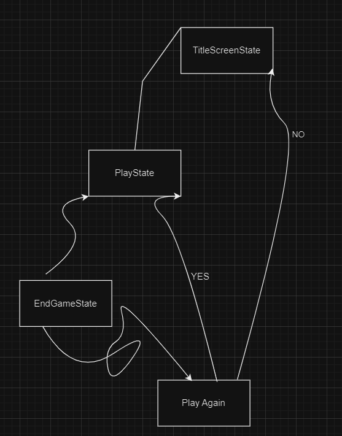
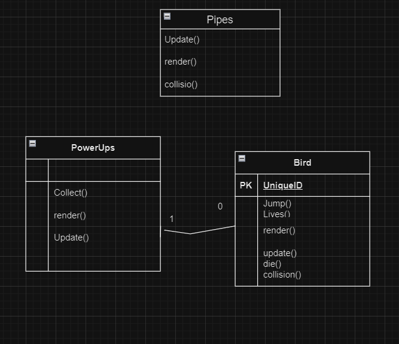
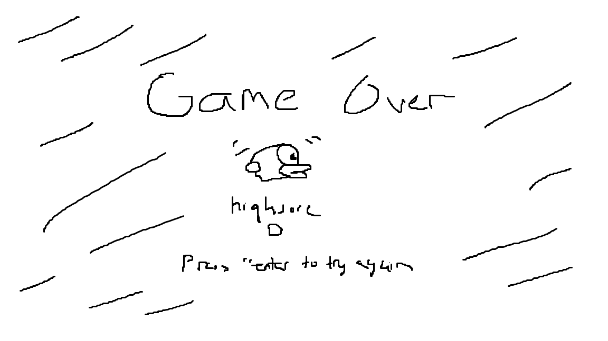

# Final Project

-   [ ] Read the [project requirements](https://vikramsinghmtl.github.io/420-5P6-Game-Programming/project/requirements).
-   [ ] Replace the sample proposal below with the one for your game idea.
-   [ ] Get the proposal greenlit by Vik.
-   [ ] Place any assets in `assets/` and remember to update `src/config.json`.
-   [ ] Decide on a height and width inside `src/globals.js`. The height and width will most likely be determined based on the size of the assets you find.
-   [ ] Start building the individual components of your game, constantly referring to the proposal you wrote to keep yourself on track.
-   [ ] Good luck, you got this!

---

# Sample Proposal - Pokémon the Trading Card Game

> [!note]
> This was taken from a project I did in university so the scope is **much** larger than what I'm expecting from you in terms of number of features!

## ✒️ Description

In this flappy bird game , we will have to go in between the pipes by pressing on spacebar to make the bird jump. The player will have 2 lives , once it hits a pipe it will lose a life. There is a powerup that makes you invincible for a certain period of time .There will also be a power up were the pipes will be slowed down.There will be another power up where it makes the bird smaller. Once dead, score is checked if it is highest high score, if it is then it will replace current highscore.

## 🕹️ Gameplay

Players begin the game by having the bird starting in the middle of the screen. Once a player hits the spacebar to start the game, the bird will jump and the player will have to keep pressing spacebar to keep the bird from falling or from going to high. As the game keeps going , pipes will appear that the player will have to make the bird go thru, if the player hits the floor or the ceiling they will lose the game automatically. If the player hits a pipe they will lose a life, once a player loses all their lives, they die and the game ends. Everytime the player goes thru a pipe , the players score will go up by 1. If the player beat their highest score , then the highscore will change to the highest score. 

There are also powerups that the player can collect throughout the game . One of them makes the bird invincible for a certain period of time, which means they can go thru the pipes wthout dying if they hit them, but if they hit the floor or the ceiling they still die. Another powerup is where the pipes will come at a slower rate which will make it easier to go thru the pipes. There will be one where whatever points you get, the points will be double for a period of time.The Power ups will randomly appear accross the game and the player will have to go on to the power ups to collect them with the bird.

There are 3 different birds, the yellow default bird which has default values has the special ability of jumping higher. the blue bird has 25% more gravity applied to it than the yellow bird and has the ability to glide for a certain period of time. The red bird has 50% more gravity than the yellow bird and has the ability to dash thru the map a certain distance.

## 📃 Requirements

> [!note]
> This was a web project so that's why you'll see requirements about logging in and uploading data which for you is irrelevant. Focus more on the requirements describing actions taken for gameplay.

1. The user shall press spacebar to start the game.
2. The user shall keep pressing spacebar to stay alive and keep the bird in the air.

### 🤖 State Diagram

> [!note]
> Remember that you'll need diagrams for not only game states but entity states as well.

### 🗺️ Class Diagram

### 🧵 Wireframes

> [!note]
> Your wireframes don't have to be super polished. They can even be black/white and hand drawn. I'm just looking for a rough idea about what you're visualizing.

### 🎨 Assets

We use paint for the wireframes and also hand drew them.

We plan on following trends already found in other Flappy bird games.

The GUI will be kept simple and playful, as to make sure the game is easy to understand what each component does and is.

#### 🖼️ Images

-   Most images will be used from a git repos ,[Flappy bird sprites repos](https://github.com/samuelcust/flappy-bird-assets/tree/master/sprites).

#### ✏️ Fonts

For fonts, Flappy Birdy by Geronimo Font Studios will look quite nice. It's a font that looks good for retro games, it will be the font used for most of the text.

-   [Flappy Bird](https://www.dafont.com/search.php?q=flappy+bird)

#### 🔊 Sounds

All sounds are going to be taken from [freesound.org](https://freesound.org) for the actions pertaining to the bird.

-   [Jumping](https://freesound.org/people/combine2005/sounds/488275/)
-   [Hit sound](https://www.101soundboards.com/sounds/13786-flappy-bird-hit-sound)
-   [Point Sound](https://www.101soundboards.com/sounds/13786-flappy-bird-hit-sound)- maybe
-   [Death sound](https://www.101soundboards.com/sounds/13785-die) - maybe

